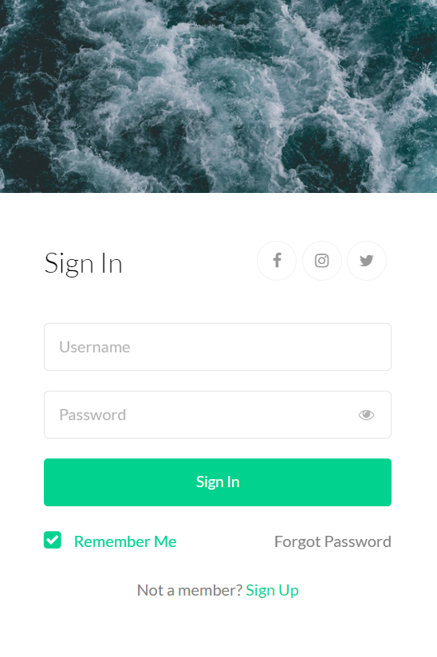

# Login Form Project with PHP, MySQL, and SweetAlert 🚀

The Login Form Project is a web application built using PHP and MySQL for user authentication and the SweetAlert JavaScript plugin for interactive and stylish alerts. It allows users to sign in securely and gain access to specific content or functionalities based on their credentials.

## ⭐️ Key Features

- 🔒 Secure User Authentication: Users can sign in using their registered email and password securely stored in the MySQL database.
- 💼 User Registration: New users can register by providing their email and creating a password, which is hashed before being stored in the database.
- 🍬 SweetAlert Alerts: SweetAlert is integrated to display visually appealing and interactive alerts for successful login, registration, and error messages.
- 🚪 Access Control: After successful login, users can access restricted content or perform specific actions based on their role or user type.

## 🚀 Getting Started

To run the Login Form project, follow these steps:

1. Clone the repository to your local web server or hosting environment.
2. Set up a MySQL database and import the provided schema.
3. Update the `config.php` file with your database credentials.
4. Access the application via your web browser and start using the login form.

## 🛠 Technology Stack

- 🐘 PHP: The primary scripting language used for server-side processing and user authentication.
- 🏢 MySQL: The database management system used to store user credentials and other relevant data.
- 🍬 SweetAlert: A JavaScript plugin used for displaying attractive and interactive alerts.

## 🤝 Contributing

Contributions, bug reports, and feature requests are welcome! Feel free to open an issue or submit a pull request.

## 📄 Project Structure

- [index.php](index.php): Contains the main login form and authentication logic.
- [register.php](register.php): Handles user registration functionality.
- [secure.php](secure.php): Secure page and can only be accessed by valid users

🔐 Start securing your web application with this PHP, MySQL, and SweetAlert Login Form! 🔐
